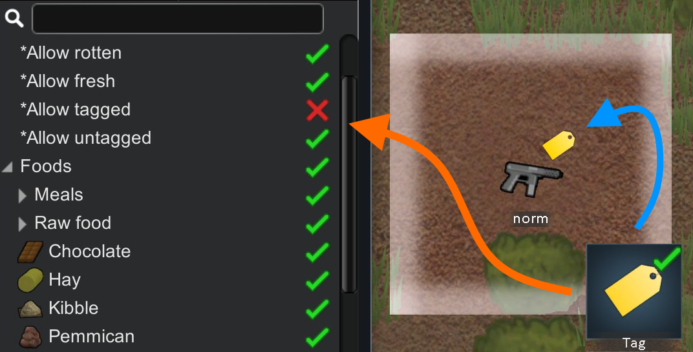

# Tag It for RimWorld

This is a little QoL mod that allows players to tag individual items. The tag filter helps to create ad-hoc stockpiles, e.g. a dump zone or a favorite zone. It also comes in handy if you want to use a particular thing as the recipe ingredient for a bill.

Feedback is welcome. Please leave a comment if you spot any issues or have any suggestions! Hope you like it.

## Remarks

- New stockpiles would have "Allow tagged" unchecked.
- Splitting off a stack would inherit the tag.
- Merging would aggregate the tags.
- If you spot any incompatibility, please try disabling the tag icon overlay in the settings.

## Credits

- Someone told me XeoNovaDan had already published a similar mod Favourites! (I didn't notice it when I searched for the tagging / marking feature on Steam workshop before I decided to create one myself.) I think his mod provides more features, so please have a check.

---

# 标签

允许玩家标记地上的物品。标签过滤器用来方便的创造临时储存区。比如说可以设定一个垃圾区域，小人会自动搬运标记的物品到这里。制作清单的时候如果需要也可以标记来指定使用某些原料。

